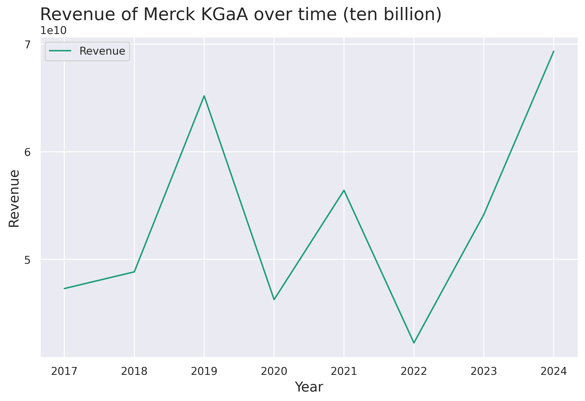

# Top Twelve German Companies

## 1. Introduction

The Top Twelve German Companies is a Data Science authorial project developed using Python libraries to analyze the top twelve German companies’ financial health from 2017 to 2024. Throughout this project it’ll be answered some questions about this matter.

### 1.1 Dataset key features

The <a href="https://www.kaggle.com/datasets/willianoliveiragibin/top-12-german-companies">dataset</a> used in this project was obtained from <a href="https://www.kaggle.com/">Kaggle</a>. Next, there is some information about the data structure and key features of it.

<ul>
  <li>Company: This field identifies the company associated with the financial data, such as "Volkswagen AG" or "Siemens AG." It categorizes the data for cross-company comparisons and trend analysis of individual organizations.</li>
  <li>Period: Representing the specific quarter in year-month format (e.g., "2017-03-31" for Q1 2017), this field is critical for tracking temporal trends in financial performance, allowing users to analyze year-over-year or quarter-over-quarter changes.</li>
  <li>Revenue: Captured in billions of Euros, revenue reflects the total sales performance of a company for the given quarter. It provides insights into the company’s market reach and the demand for its products or services during each period.</li>
  <li>Net Income: Expressed in billions of Euros, net income denotes the company’s profit after all expenses for the quarter. This metric is a cornerstone of profitability analysis, reflecting the financial efficiency and success of operational strategies.</li>
  <li>Liabilities: Recorded in billions of Euros, liabilities represent the total debt and obligations of a company for a specific quarter. This data is essential for understanding the company’s financial leverage and assessing its exposure to financial risks.</li>
  <li>Assets: Assets, measured in billions of Euros, encompass all resources owned by a company with economic value. This metric reflects the scale and capacity of the company’s operations and investments, serving as a benchmark for evaluating organizational size and financial resourcefulness.</li>
  <li>Equity: Equity is calculated as Assets minus Liabilities and is expressed in billions of Euros. This metric represents the residual value available to shareholders, offering insights into financial stability and value creation within the organization.</li> 
  <li>ROA (Return on Assets): ROA, expressed as a percentage, is derived from the formula: (Net Income/Assets)×100. It measures the company’s ability to generate profit from its assets, providing a lens into operational efficiency.</li> 
  <li>ROE (Return on Equity): Calculated as: (Net Income/Equity)×100, ROE, expressed as a percentage, highlights the profitability of a company from shareholders' investments, serving as a key performance indicator.</li>
  <li>Debt to Equity Ratio: This ratio, representing the proportion of Liabilities to Equity, sheds light on the company’s capital structure. It is crucial for understanding financial leverage, revealing the balance between debt financing and shareholder equity in the company's operations.</li>
</ul>

### 1.2 Questions to be answered

Next, there are some questions about the current financial condition of some of the most profitable German companies. These questions will be answered throughout the development of this project. To analyze the results, whenever possible, charts will be plotted.

<ul>
  <li>What’s the company who demonstrates the biggest revenue over time?</li>
  <li>And about the company who demonstrates the biggest net income? Is it the same company?</li>
  <li>About the company who demonstrates the biggest revenue, what’s its assets over time?</li>
  <li>And about the company who demonstrates the biggest net income, what’s its equity over time?</li>
  <li>What’s the relation of the assets and liabilities between the company who demonstrates the biggest equity in 2024?</li>
  <li>Among the companies who work in the automobilistic industry, who demonstrates the nicest debt to equity indicator in 2024?</li>
</ul>

## 2. Data analysis

### 2.1 The biggest revenue over time

Considering the concept of revenue, which is the total amount of money a company generates from its primary operations, or, essentially, the income a business earns from selling its goods or services, it was found the company who had the highest revenue from 2017 to 2024, which is Merck KGaA. This company is focused in science and technology, and has been demonstrating a good revenue performance since 2017.

  

 

Looking at the chart it’s possible to see this performance through the years. The Merck KGaA’s revenue was growing until the end of 2019, when the COVID-19 pandemic started. Right after that, the company presented some difficulties to keep constant. Although, from 2022, when the pandemic ended, to 2024 Merck 	KGaA’s revenue demonstrated a good stability, surpassing its best mark in 2019.

